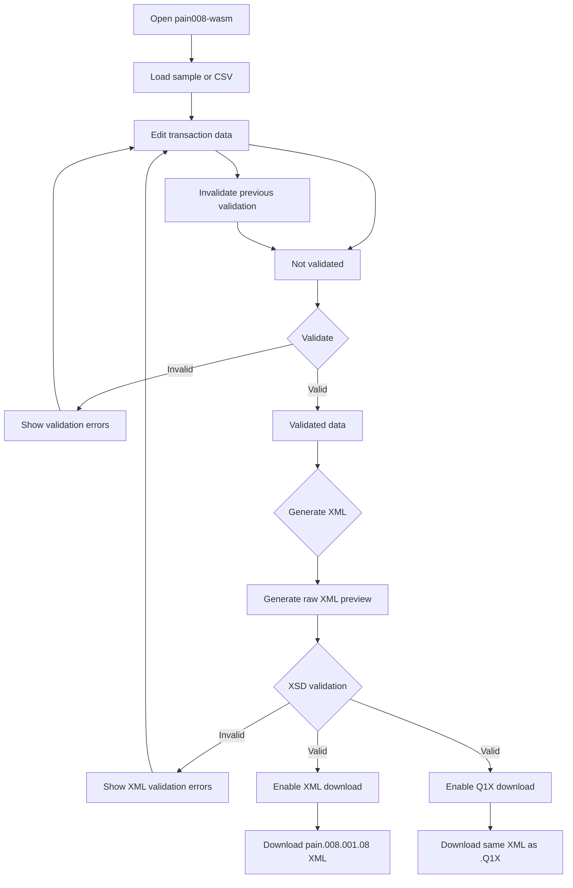

# pain008-wasm

Client-side **SEPA Direct Debit (`pain.008.001.08`) generator** running entirely in the browser with Python compiled to WebAssembly.

The application provides a GitHub Pages interface for loading transaction data, validating it against the SEPA scheme, and generating the corresponding XML file.

## Features

* 100% client-side execution.
* No server or backend required.
* CSV and sample-data loading.
* Manual SEPA/XSD validation.
* `pain.008.001.08` XML generation.
* Optional `.Q1X` download using the same generated XML content.
* Raw XML preview for inspecting the generated document.
* XML and Q1X downloads are enabled only after successful final validation.

## Technology

* [Pyodide](https://pyodide.org/) — Python running in WebAssembly.
* [pain001](https://pypi.org/project/pain001/) — SEPA payment message generation and validation.
* Python WebAssembly, single-threaded.
* `pain.008.001.08` — SEPA Direct Debit.
* GitHub Pages.
* GitHub Actions.

## Validation

Validation is **strictly manual**.

The application does not run validation automatically when:

* the page is opened;
* sample data is loaded;
* a CSV file is loaded;
* a form field is edited.

The **Validate** button is the only action that executes the `pain001` scheme validation.

The application starts in the `Not validated` state.

After a successful validation, modifying any input field invalidates the previous validation result. The data must then be validated again before XML or Q1X can be downloaded.

This ensures that the generated file always corresponds to the data that was actually validated.

## Validation flow



## Optional fields

Optional fields are omitted when they are empty.

In particular:

* `debtor_bic` is optional.
* `creditor_bic` is optional.
* `remittance` is optional.

Empty optional values are not sent to `pain001` as `None` values.

For BIC validation, when a BIC is absent, an internal valid-format sentinel may be used only for the validation step. The sentinel is never included in the generated XML.

## Input data

Each transaction requires:

* `mandate_id`
* `mandate_signed_on`

The following fields are optional:

* `debtor_bic`
* `remittance`

If the CSV does not contain a `sequence_type` column, `OOFF` is used.

Blank `sequence_type` values also default to `OOFF`.

`PmtInfId` is generated automatically.

## Dates

Dates such as `collection_date` and `mandate_signed_on` are normalized to ISO format:

```text
YYYY-MM-DD
```

The generator accepts the mandate signature date through the following supported field names:

* `mandate_signed_on`
* `mandate_signature_date`
* `mandate_date_of_signature`
* `date_of_signature`

## SEPA scheme validation

`pain001.validate_scheme()` expects canonical identifier keys.

The validation payload therefore uses:

```text
debtor_account_IBAN
creditor_account_IBAN
debtor_agent_BIC
creditor_agent_BIC
```

rather than lowercase variants such as:

```text
debtor_account_iban
creditor_account_iban
debtor_agent_bic
creditor_agent_bic
```

This mapping is required for correct IBAN and BIC scheme validation.

## XML generation

There are two distinct generation paths:

### Raw XML preview

The **Generate XML** action can render a raw XML preview even when scheme or XSD validation reports an error.

This preview is intended for inspection and debugging.

It does **not** authorize downloading the file.

### Validated XML

The final XML generation path uses:

```text
generate_xml_string()
```

The XML and Q1X downloads are enabled only when the final generated document successfully passes XSD validation.

This prevents an invalid document from being downloaded even if a raw preview can be displayed.

## Q1X

The Q1X download contains the same generated `pain.008.001.08` XML content as the XML download.

Only the file extension differs:

```text
.Q1X
```

This matches the supplied bank example format.

## Browser cache

The JavaScript asset is cache-busted when necessary so that GitHub Pages does not continue serving an older browser copy after deployment.

## Deployment

The project is designed to run as a static GitHub Pages application.

GitHub Actions can be used to build and deploy the application without requiring a server-side runtime.

Once deployed, the complete generation and validation workflow runs locally in the user's browser.

## Privacy

No transaction data needs to be sent to a server for XML generation or validation.

The application is designed to process the data entirely client-side.

## Project structure

A typical deployment contains:

```text
pain008-wasm/
├── index.html
├── try-pain008.js
├── python/
    └── pain008.py
├── ...
└── .github/
    └── workflows/
        └── ...
```

The exact project structure may evolve independently from the application behaviour described in this document.
